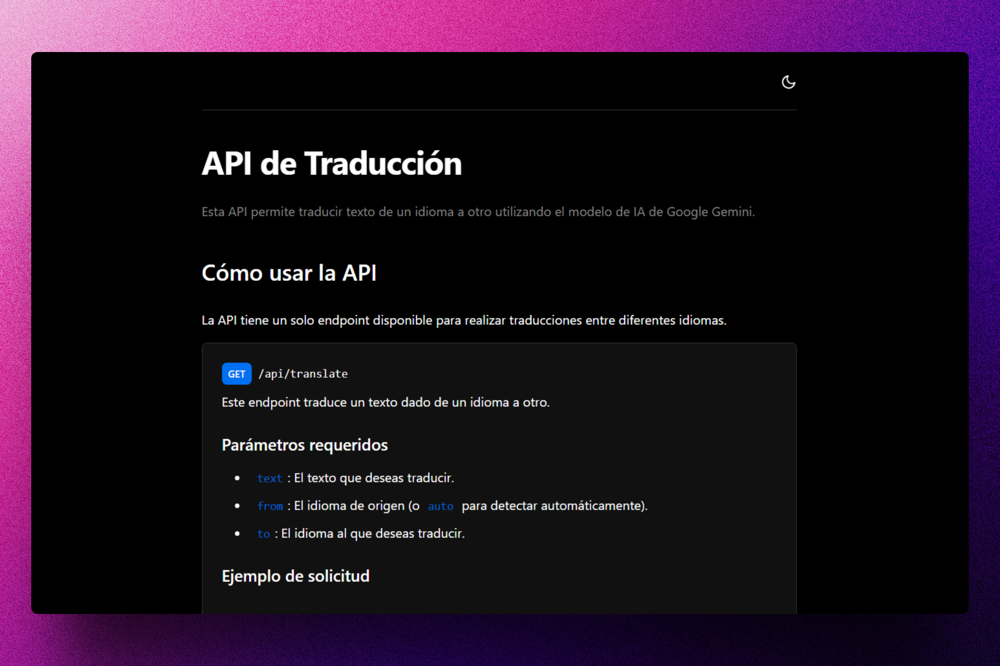
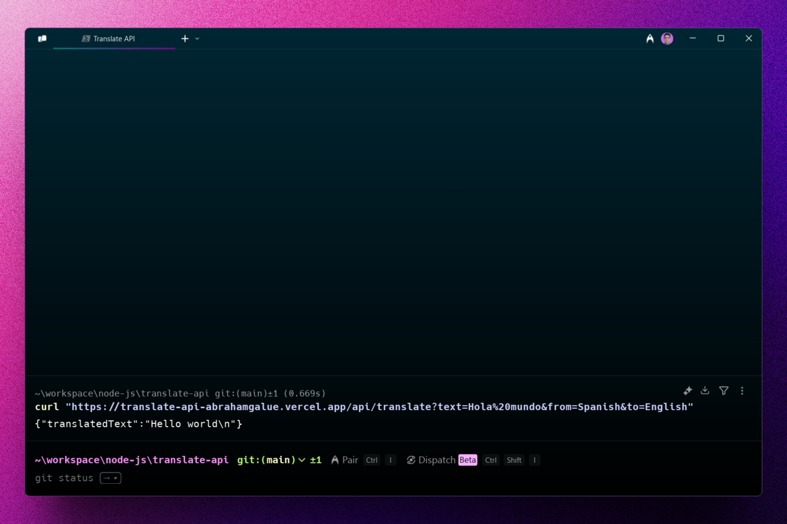

<div align='center'>

# 🌐 NODE/EXPRESS: Translate API

</div>

### API para traducir texto de un idioma a otro.

> 🧩 Aquí puedes ver su [**Live Demo.**](https://translate-api-abrahamgalue.vercel.app/)





## 🚀 Descripción

Esta API permite traducir texto de un idioma a otro utilizando el modelo de IA de Google Gemini.

Si quieres ver una implementación real, puedes visitar [**Google Translate Clone**](https://github.com/abrahamgalue/react-projects-course-midudev/tree/main/09-google-translate-clone).

## ⚡ Comenzar

### Prerrequisitos

1. Git.
2. Node.js: cualquier versión a partir de la 20 o superior.

## 🔧 Instalación

### Usando npm

1. **Clona el repositorio:**

   ```bash
   git clone https://github.com/abrahamgalue/translate-api.git
   cd translate-api
   ```

2. **Instala las dependencias:**

   ```bash
   npm install
   ```

### Ejecución local (modo desarrollo)

1. **Inicia el servidor de desarrollo:**

   ```bash
   npm run dev
   ```

   Esto iniciará el servidor de desarrollo en Express y tu aplicación estará disponible en `http://localhost:3001`.

   > **Nota:** Para que tu aplicación funcione correctamente, asegúrate de tener configurada la variable de entorno `GEMINI_API_KEY` con tu [**clave de API de Google**](https://ai.google.dev/gemini-api/docs/api-key). Puedes crear un archivo `.env` en la raíz del proyecto y agregar la siguiente línea:

   ```bash
   GEMINI_API_KEY=tu_clave_de_api
   ```
2. También puedes usar **Vercel CLI** para iniciar el servidor:

   ```bash
   vercel dev
   ```

   Para mas información te recomiendo leer la [documentación de Vercel](https://vercel.com/guides/using-express-with-vercel).

   > Nota: como podrás ver la api esta construida de tal modo que puedas usar cualquier modelo de IA, ya que el código sigue las mejores practicas. Siéntete libre de experimentar con diferentes modelos de IA!

## 🎭 Tecnologías

El proyecto utiliza las siguientes tecnologías:

- [**Express**](https://expressjs.com/) como framework de Node.js.
- [**Google Gen AI SDK**](https://www.npmjs.com/package/@google/genai) para interactuar con el modelo Gemini.
- [**Mistral Typescript Client**](https://www.npmjs.com/package/@mistralai/mistralai) para interactuar con el modelo de Mistral.
- [**Vercel**](https://vercel.com/home) para desplegar la aplicación.